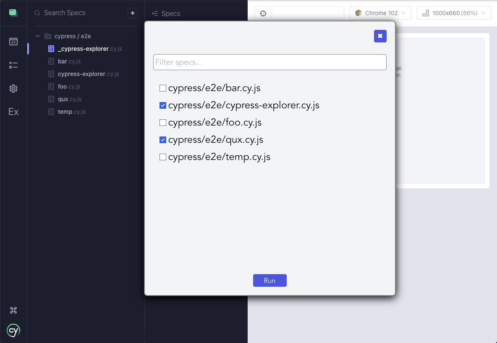

## Cypress Explorer

A simple file explorer that can run multiple specs for Cypress 10.

**Warning** very experimental, relies on internal APIs, hardly tested.

- Screenshot: 


- Demo: 


### Installation

- `yarn add cypress-explorer --dev`
- `npm install cypress-explorer --dev`

### Usage

1. Install the plugin (`cypress.config.ts`)

```ts
import { defineConfig } from 'cypress'
import { startExplorerServer } from 'cypress-explorer/server'

export default defineConfig({
  e2e: {
    async setupNodeEvents (on, config) {
      await startExplorerServer()
    }
  }
})
```

2. Install the command (`cypress/commands/e2e.ts`)

```ts
import { registerCypressExplorer } from 'cypress-explorer'

registerCypressExplorer()
```

### How It Works

**Warning** this plugin uses many hacks, internal Cypress APIs, etc. It's also highly experimental and assumes you are using the default `specPattern`, which means your E2E specs are in `cypress/e2e/**/*.cy.*`.

The approach is similar to the one suggested by Gleb Bahmutov in his [blog post](https://glebbahmutov.com/blog/run-all-specs-cypress-v10/) for a temporary work around to the "Run All Specs" button, which due to technical limitations, was removed from Cypress 10 (until the limitations are solved, and it is returned). It creates a temporary spec, `_cypress-explorer.cy.js`, and imports all the specs you want to run. It then navigates to the temprary spec and executes them all.

The main difference is Cypress Explorer provides you a simple UI, where you can simply check the specs you want to run. It writes them all to a `cypress-explorer.cy.js` file, which imports all your specs. So, just select `cypress-explorer.cy.js` from the sidebar, and you can run all your specs.


### Known Issues

Same as "Run All Specs" in Cypress 9:

- out of memory when running large amount of specs due to snapshots consuming a lot of memory
- non deterministic (code from other tests can impact each other, since they all run in the same scope)
- not working for Component Testing (yet, fix soon)
- does not respect custom `specPattern`
- probably not working on Windows (fix soon)
- probably doesn't handle mix of JS/TS correctly
- not tested with `type: module` or native ESM
- does not support `jsx` or `tsx` extensions (fix soon)
- very ugly UI (PR definitely welcome on this front)
- likely lots of other bugs, it's a work in progress!

### TODO

- [ ] Support custom specPattern, other configuration
- [ ] Less ugly UI
- [ ] Test thoroughly
- [ ] Keyboard shortcuts for the Explorer UI

### Developing

Clone this, install with `yarn`. Run `yarn build:ui --watch` in watch mode for the front-end. You need to restart for changes to the server.